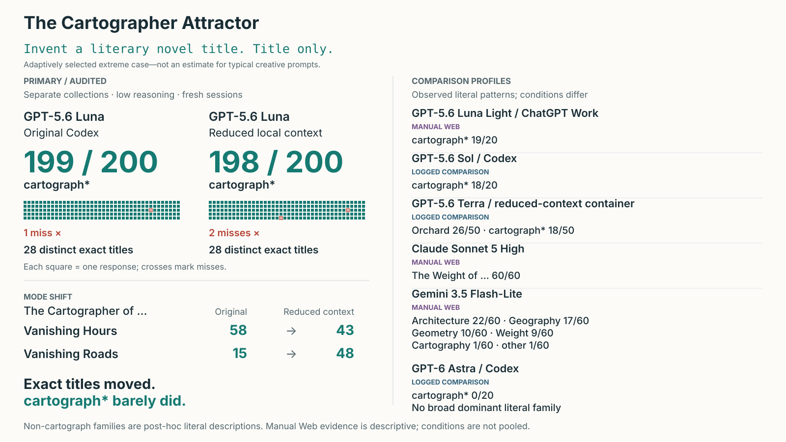
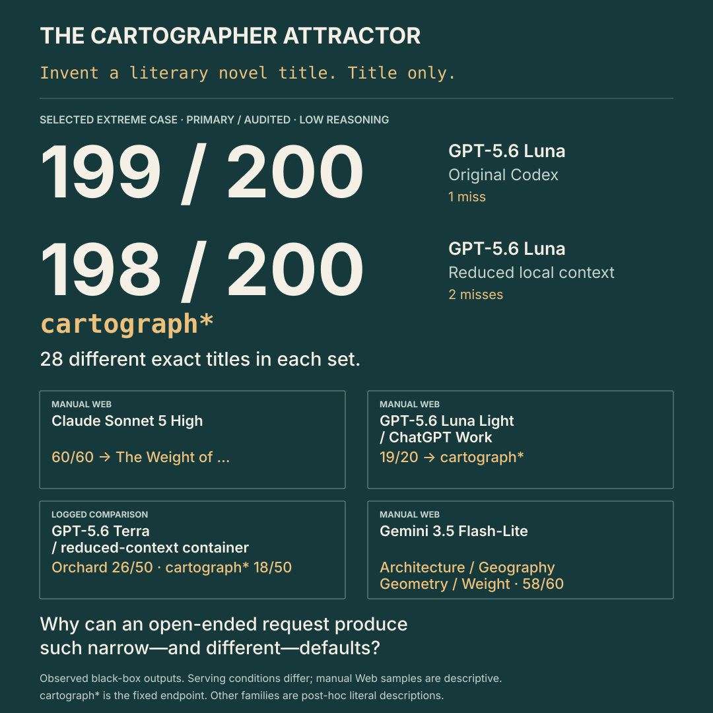

# The Cartographer Attractor

**I asked GPT-5.6 Luna the same open-ended creative question in 200 fresh Codex
sessions. 199 answers contained `cartograph*`. After substantially reducing the
surrounding local context, I repeated the experiment: 198 of 200 answers did it
again.**

```text
Invent a literary novel title. Title only.
```

The prompt supplies no plot, character, setting, occupation, or example. Yet both
sets contained **28 different exact titles**: considerable variation in the
answers, almost entirely within one lexical family. The exact-title frequencies
changed; the extreme `cartograph*` concentration barely did. Both collections
used low reasoning effort.

**This prompt was selected during exploration because it was an unusually strong
case.** These results show what happened under the recorded conditions—not how
a typical creative prompt behaves.

The comparison samples raise a further question. Several other tested systems
also repeatedly used `cartograph*`; some instead favored constructions such as
`The Weight of …`, `The Orchard of …`, or Architecture/Geography/Geometry titles.
These include smaller logged tests and less-controlled manual Web observations,
not a controlled model leaderboard. **Why can so much apparent variation collapse
into a few recurring creative defaults—and why do those defaults differ across
systems?**



*Exact titles moved; root-level concentration barely did. Each square above is
one valid response; crosses mark misses. Comparison profiles carry explicit
evidence labels.* [Primary ledgers](data) · [Comparison data](data/models)

Here, **`cartograph*` is a fixed, case-insensitive lexical endpoint**: a response
counts if it contains a word beginning `cartograph`. “Attractor” is only shorthand
for recurrent concentration in observed outputs. It is not a claim about an
internal dynamical system.

## 1. The extreme case

The primary evidence consists of two separate 200-response collections. They are
compared, not pooled as one experiment.

| GPT-5.6 Luna condition | `cartograph*` | Cartographer | Cartography | Distinct exact titles | Attempts |
|---|---:|---:|---:|---:|---:|
| [GPT-5.6 Luna / original Codex · low](data/luna_codex_200.csv) | **199/200** | 157 | 42 | 28 | 201 |
| [GPT-5.6 Luna / reduced local context · low](data/luna_reduced_context_200.csv) | **198/200** | 154 | 44 | 28 | 202 |

The collections shared 14 exact titles, but their most frequent titles differed:

| Exact title | Original / 200 | Reduced context / 200 |
|---|---:|---:|
| *The Cartographer of Vanishing Hours* | 58 | 43 |
| *The Cartographer of Unfinished Rain* | 40 | 15 |
| *The Cartographer of Unfinished Goodbyes* | 21 | 9 |
| *The Cartographer of Vanishing Roads* | 15 | 48 |
| *The Cartography of Vanishing Light* | 9 | 19 |

The original collection's single miss was *The Orchard of Unsaid Things*. The
reduced-context misses were *The Silence Between Falling Stars* and *The Silence
Between Tides*. All attempts, including failures and exclusions, remain in the
public ledgers.

The result is therefore not one exact title repeated 199 times. It is substantial
exact-title variation inside an unusually concentrated lexical family.

## 2. Is Cartography the whole phenomenon?

The same requested task was also tested in other recorded or manually observed
conditions. These data should not be read as a controlled leaderboard: interfaces,
wrappers, collection records, and sample sizes differ. They are useful because the
observed concentration profiles differ so much.

| Model / serving condition | Evidence | n | `cartograph*` | Distinct | Dominant literal family or construction | Modal exact title |
|---|---|---:|---:|---:|---|---|
| [GPT-5.6 Luna / original Codex · low](data/luna_codex_200.csv) | Primary audited | 200 | **199/200** | 28 | `cartograph*` 199/200 | *The Cartographer of Vanishing Hours* · 58 |
| [GPT-5.6 Luna / reduced-context container · low](data/luna_reduced_context_200.csv) | Primary audited | 200 | **198/200** | 28 | `cartograph*` 198/200 | *The Cartographer of Vanishing Roads* · 48 |
| [GPT-5.6 Terra / reduced-context container · low](data/models/logged/terra_container.csv) | Logged comparison | 50 | 18/50 | 19 | `The Orchard of …` 26/50 | *The Cartographer of Ashes* · 12 |
| [GPT-5.6 Sol / Codex · low](data/models/logged/sol_codex.csv) | Logged comparison | 20 | 18/20 | 10 | `cartograph*` 18/20 | two titles tied · 4 each |
| [GPT-6 Astra / Codex · low](data/models/logged/astra_codex.csv) | Logged comparison | 20 | 0/20 | 11 | top extracted heads tied · 3 each | four titles tied · 3 each |
| [GPT-5.6 Luna Light / ChatGPT Work](data/models/web/work_luna_light.txt) | Manual Web | 20 | 19/20 | 5 | `cartograph*` 19/20 | *Cartography of Vanishing Things* · 10 |
| [Claude Haiku 4.5](data/models/web/claude_haiku_4_5.txt) | Manual Web | 60 | 49/60 | 24 | `cartograph*` 49/60 | *The Cartographer's Daughter* · 12 |
| [Claude Sonnet 5 High](data/models/web/claude_sonnet_5_high.txt) | Manual Web | 60 | 0/60 | 17 | `The Weight of …` 60/60 | *The Weight of Unfinished Rooms* · 17 |
| [DeepSeek — Instant, search off](data/models/web/deepseek_instant.txt) | Manual Web | 62 | 49/62 | 21 | `cartograph*` 49/62 | *The Cartography of Unspoken Things* · 25 |
| [Grok — Fast mode](data/models/web/grok_fast.txt) | Manual Web | 51 | 28/51 | 34 | `cartograph*` 28/51 | *The Cartography of Silence* · 7 |
| [Gemini 3.5 Flash-Lite](data/models/web/gemini_3_5_flash_lite.txt) | Manual Web | 60 | 1/60 | 33 | `The Architecture of …` 22/60 | *The Architecture of Falling Water* · 9 |
| [GPT-5.6 Terra Light](data/models/web/gpt_5_6_terra_light.txt) | Manual Web | 20 | 3/20 | 12 | `The Orchard of …` 12/20 | *The Orchard of Unsaid Things* · 6 |

For scale, nominal 95% Wilson intervals for the fixed `cartograph*` proportion
are 97.2%–99.9% for original GPT-5.6 Luna, 96.4%–99.7% for reduced-context
GPT-5.6 Luna, 69.9%–97.2% for GPT-5.6 Sol, 41.4%–67.7% for Grok — Fast mode, and
0.0%–16.1% for GPT-6 Astra. The analyzer prints the interval for every condition.
These intervals use an IID Bernoulli approximation; they do not account for hidden
dependence, routing changes, serving changes, or other deployment uncertainty.

The dominant-family column is **post-hoc and descriptive**, except for the fixed
`cartograph*` endpoint. It is computed literally: for example, `The Weight of …`
means exactly that prefix, and `The [HEAD] of …` heads are extracted from the text.
No semantic clustering is used. Counts normalize only surrounding Markdown
emphasis, quotation marks, and transcript numbering; the submitted response text
is unchanged.

## 3. Different systems, different defaults

Cartography is not universal. GPT-6 Astra produced no `cartograph*` response in 20
logged Codex trials. Claude Sonnet 5 High produced none in 60 manually supplied
responses—but all 60 began exactly `The Weight of …`. Gemini 3.5 Flash-Lite produced one `cartograph*` response
in 60; its mechanically extracted heads were *Architecture* (22), *Geography*
(17), *Geometry* (10), *Weight* (9), and *Cartography* (1).

GPT-5.6 Terra's logged container result was mixed: 26/50 responses began
`The Orchard of …`, while 18/50 contained `cartograph*`. Manual GPT-5.6 Terra
Light favored `The Orchard of …` in 12/20 and contained `cartograph*` in 3/20. These are different serving
conditions and are not combined.

The GPT-5.6 Luna Light / ChatGPT Work list presents another contrast. Its 19 root
hits comprised 17 *Cartography* and 2 *Cartographer*. Original GPT-5.6 Luna in
Codex instead produced 157
*Cartographer* and 42 *Cartography* among 199 hits. The larger family persisted,
but its preferred realization changed. The reported Luna-light label does not
establish backend equivalence with Codex GPT-5.6 Luna.

When there is no correct title and little supplied subject matter, why can
repeated outputs from a model/serving condition occupy such a small repertoire
of recurring creative starting points?



*The same lexical endpoint can recur strongly in one condition and be absent in
another. Weight and Orchard remain separate descriptive observations.*
[Underlying model records and provenance](data/models)

## 4. Literal overlaps across conditions

Across **823 responses from 12 observed conditions**, there were **202 normalized
distinct exact titles**. 29 appeared in more than one condition; seven appeared
in at least three; two appeared in five.
This is descriptive orientation, not a significance test: there is no justified
uniform null model for title overlap.

Some of those exact overlaps are especially useful for comparison:

- *The Cartographer of Lost Hours* appears in five conditions: original GPT-5.6
  Luna (1), reduced-context GPT-5.6 Luna (7), Claude Haiku 4.5 (9),
  DeepSeek — Instant, search off (1), and Grok — Fast mode (3).
- *The Cartographer of Vanishing Rooms* appears in both GPT-5.6 Luna conditions,
  logged GPT-5.6 Terra, GPT-5.6 Sol, and manual GPT-5.6 Terra Light.
- *The Cartography of Unspoken Things* is DeepSeek's mode (25), but also appears
  once in reduced-context GPT-5.6 Luna and once in Claude Haiku 4.5.
- *The Cartography of Silence* occurs 4 times in GPT-5.6 Sol and 7 times in
  Grok — Fast mode.
- Original GPT-5.6 Luna's sole exception, *The Orchard of Unsaid Things*, occurs
  8 times in logged GPT-5.6 Terra and 6 times in manual GPT-5.6 Terra Light.
- One reduced-context GPT-5.6 Luna exception, *The Silence Between Tides*, also
  occurs once in logged GPT-5.6 Terra and once in manual GPT-5.6 Terra Light.

These are literal cross-condition overlaps, not evidence of a shared cause. The
analysis script prints every overlap and the full extracted-head distributions.

## 5. Could GPT-5.6 Luna's local environment explain it?

The original Codex condition was not a bare prompt sent directly to model weights.
Its local preview included a 17,730-character instruction template, a project path,
permissions, tools and skills, a date, and environment metadata. A separate
creative test had even reproduced the project name, making context contamination
a real concern.

The reduced-context condition retained the same recorded GPT-5.6 Luna identifier,
low reasoning setting, and canonical prompt, but ran each session in an empty `/w`
workspace inside a fixed container. The research tree and prior titles were not
mounted. Major tools and Web search were disabled. The local instruction became
the 27-character line `Follow the user's request.` Average reported input usage
fell from 5,536 to 1,782 tokens per valid response.

The second collection required 202 attempts for 200 valid responses: one
usage-limit failure and one title excluded under the recorded error rule.
Both remain in the ledgers; neither was silently replaced. Including the excluded
title gives 199/201 `cartograph*` among returned answers. The valid halves scored
100/100 and 98/100.

The removed project-specific and local components were therefore **not necessary**
for near-total recurrence in this observed condition. That does not establish
context independence. The local snapshots are not full server requests; hidden
instructions, routing, account effects, decoding details, and changes over time
remain unknown. See the sanitized [original context](data/context/original_codex.md),
[reduced context](data/context/reduced_container.md), and their
[hash manifest](data/context/manifest.json).

## 6. Evidence quality

- **Primary / audited:** the two GPT-5.6 Luna ledgers preserve the exact prompt,
  response, session ID, timestamps, failures, and protocol material. The first
  prompt and later sample size were nevertheless discovered adaptively.
- **Logged comparisons:** GPT-5.6 Terra, GPT-5.6 Sol, and GPT-6 Astra preserve
  prompts and session IDs. GPT-5.6 Terra additionally preserves timestamps,
  usage, raw event streams, source, and a frozen protocol. These remain distinct
  model/serving conditions.
- **Manual Web:** one response file is preserved for each reported condition.
  These lists are useful descriptive evidence, but generally lack per-response
  exports, session IDs, complete settings, dates, and independent completeness
  checks. “Fresh” where reported is a collection property, not proof of IID
  sampling.

The [metadata table](data/models/metadata.csv) records known collection episodes
within manual lists. Their table totals combine episodes under the same reported
condition; they do not establish uninterrupted collection or unchanged settings.
Different model/serving conditions and evidence tiers remain separate.

## 7. How this was found

I began with manual Web experiments using repeated arbitrary-choice prompts.
When asking for numbers from 1–30, I noticed recurring choices such as 17 and 23;
for letters from A–Z, I noticed M and Q. I then deliberately moved to broad
creative and title prompts requesting far less constrained outputs, to see whether
concentration would persist without an obvious small set of answers.

`cartograph*` began appearing across several related title prompts. I added and
removed words and simplified the wording until I reached
`Invent a literary novel title. Title only.` I chose this version for deeper study
because it produced the clearest and most consistent pattern during exploration.
This is an intentionally selected extreme case, not a random sample of creative
prompts or a prompt preregistered before discovery. The recorded GPT-5.6 Luna
sample then grew in several stages.

The canonical prompt is the most extensively measured probe, rather than the only
wording under which I observed related patterns. Other title prompts also produced
`cartograph*`, and some prompts containing “serious” appeared to favor
`The Weight of …` titles. These wording observations remain exploratory: they
have not been systematically investigated and are not analyzed as part of the
main result.

Later, I found related work and independent observations. [Austin's dangling-
document study](https://github.com/nerdyaustin/opus5-dangling-document/blob/main/REPORT.md)
reported cartograph-bearing first lines in 14/160 responses under a different
task. [Anthropic's fiction-workshop account](https://www.anthropic.com/research/multiagent-systems)
described agents independently submitting *The Cartographer's Last Commission*,
without a comparable denominator. [Artificial Hivemind](https://arxiv.org/abs/2510.22954)
studies homogeneity in open-ended model generation more broadly. These use
different tasks and collection conditions; they are context, not matched
replications.

## 8. What the data establish—and what they do not

The records establish extreme literal-root concentration in the original GPT-5.6 Luna
condition; near-replication after substantial reduction of visible local context;
exact-title diversity inside that concentration; large differences between
observed systems; and other repeated literal families in some low- or zero-
Cartography conditions.

They do not identify a mechanism. They do not establish a tokenizer effect,
shared weights or training data, bare-model behavior, universal LLM behavior,
perfectly IID samples, or equivalence among serving labels. Nor was the prompt
randomly selected from all possible prompts. A large answer space does not imply
a uniform probability distribution.

The central fact is narrower: under the recorded conditions, an underspecified
creative request sometimes produced a much smaller and more recognizable lexical
repertoire than its many plausible answers might suggest. Why each repertoire
received so much observable probability remains open.

## 9. Inspect the evidence

- Original GPT-5.6 Luna: [200 responses](data/luna_codex_200.csv) and
  [failed attempt](data/luna_codex_failed_attempts.csv)
- Reduced-context GPT-5.6 Luna: [200 valid responses](data/luna_reduced_context_200.csv),
  with source filename and row for each response. Preserved collection records:
  [initial attempts](data/luna_container_attempts.csv),
  [80 responses](data/luna_container_extension_80.csv),
  [stopped extension](data/luna_container_final_extension.csv), and
  [47-response completion](data/luna_container_completion_47.csv)
- Comparison evidence: [logged](data/models/logged), [manual Web](data/models/web),
  and [metadata](data/models/metadata.csv)
- Context records: [data/context](data/context)
- Reported usage: [data/reported_usage.csv](data/reported_usage.csv)

Run the standard-library analysis:

```sh
python3 analysis/analyze.py
```

It verifies protocol and context hashes, session uniqueness, failure accounting,
all displayed counts, exact-title overlaps, literal head distributions, reported
usage, and both SVGs. Regenerate the figures with:

```sh
python3 analysis/analyze.py --write-figures
```

Rebuild the consolidated ledger with `python3 analysis/analyze.py --write-ledger`.
It is a derived view of the four preserved segments, not an additional dataset;
the analyzer checks all 200 rows against those sources on every run.

If you try the prompt yourself, preserve every response and failure, record the
serving condition, and report non-replications as readily as replications.
